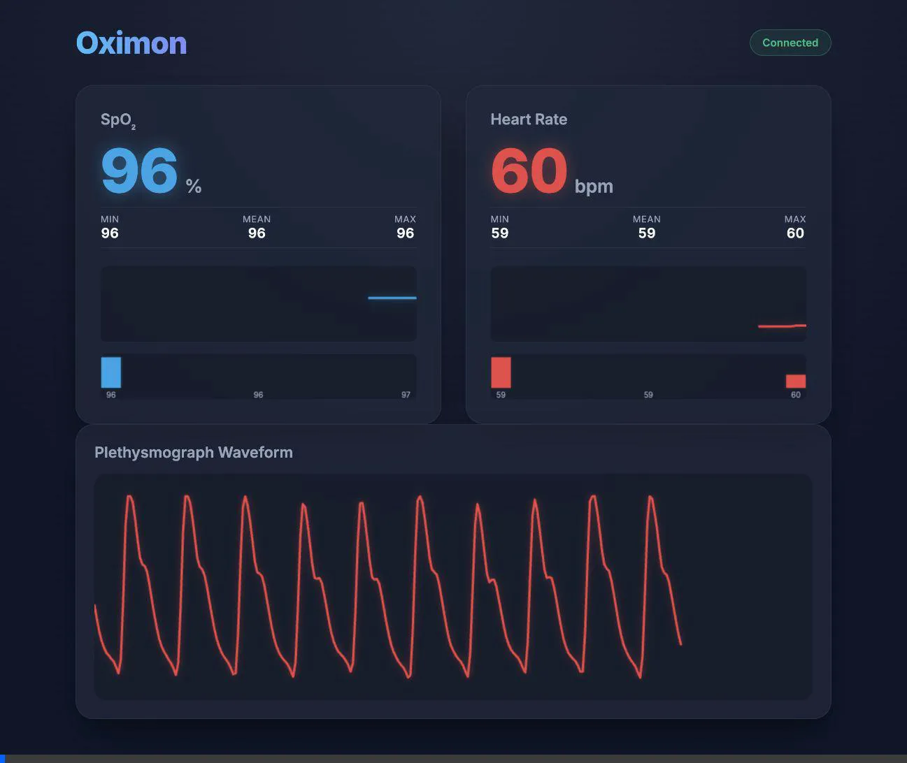

**Oximon** is a Go-based macOS background daemon that captures, persists, and streams real-time telemetry from Innovo Bluetooth oximeters (specifically the [iP900BPB](https://innovomedical.com/product/innovo-ip900bp-b-bluetooth-fingertip-pulse-oximeter/)). The daemon acts as a central hub for health data, allowing you to directly interact with your Bluetooth medical devices. Particularly, **Oximon** will allow you to:

 * Automatically discover and connect to Bluetooth LE oximeters.
 * Persist high-frequency waveforms and SpO2/Pulse readings into a local SQLite database for historical analysis.
 * Stream real-time telemetry out of the daemon via a standard gNMI gRPC interface.
 * Visualise live 50Hz plethysmograph waveforms and historical trends via a built-in WebSocket-driven Canvas Web UI.

Development of **Oximon** has been motivated by the desire to integrate personal medical devices into robust, open-source telemetry pipelines (like OpenConfig/gNMI) while maintaining a lightweight, dependency-free local dashboard. 

## Contents
* [Getting Started](#getting-started)
	* [Prerequisites](#prerequisites)
	* [Installation](#installation)
	* [Using the Daemon](#using-the-daemon)
* [Architecture](#architecture)
* [Licensing](#licensing)

## Getting Started <a name="getting-started"></a>

### Prerequisites <a name="prerequisites"></a>
**Oximon** requires macOS (due to the underlying `tinygo.org/x/bluetooth` CoreBluetooth bindings) and Go 1.20+. 

### Installation <a name="installation"></a>
Clone the repository and build the binary:

```bash
$ git clone https://github.com/robshakir/oximon.git
$ cd oximon
$ go build -o oximon .
```

### Using the Daemon <a name="using-the-daemon"></a>

The `oximon` binary provides a simple CLI to interact with your Bluetooth environment. 


#### Scanning for Devices
Before connecting, you can scan your local area to find the MAC address or local name of your oximeter:
```bash
$ ./oximon scan
Scanning for BLE devices... (Press Ctrl+C to stop)
Found device: Innovo_Oxi [XX:XX:XX:XX:XX:XX] RSSI: -50
```

#### Running in the Foreground
To start the data logger in the foreground and stream telemetry from the oximeter, use the `run` command. This will initialise the SQLite database, spin up the gNMI gRPC server on port `9339`, and start the Web UI on port `8080`.

```bash
$ ./oximon run -name "iP900BPB"
```


You can then navigate to `http://localhost:8080` in your browser to view the real-time SpO2 and Pulse graphs.



#### Running as a Background Daemon
To run the logger continuously without blocking your terminal, use the `daemon` command. This will detach the process and write all standard output and logging to `oximon.log`.

```bash
$ ./oximon daemon -name "Innovo_Oxi"
Daemon started with PID: 12345. Logs are in oximon.log
```

#### Subscribing via gNMI
**Oximon** natively streams its telemetry over a standard gNMI gRPC interface. You can use popular open-source tooling like [`gnmic`](https://gnmic.openconfig.net/) to subscribe to the data stream in real-time.

To subscribe to all metric updates (SpO2, Pulse, and the high-frequency waveform) directly from your terminal:

```bash
$ gnmic -a localhost:9339 --insecure subscribe --path /oximeter/state/
```

This will output structured JSON updates each time a new telemetry value is broadcast by the daemon.

## Architecture <a name="architecture"></a>

The **Oximon** codebase adheres strictly to Google Go style guidelines and OpenConfig idioms:
* **BLE Subsystem (`ble.go`)**: Manages CoreBluetooth state, connection retries, and characteristic subscriptions. Incoming binary payloads are cleanly decoupled and decoded via `ParsePacket`.
* **Persistence (`db.go`)**: Implements an asynchronous worker pattern utilizing a CGO-free SQLite driver (`modernc.org/sqlite`) to ensure database writes never block the Bluetooth stream.
* **Telemetry (`gnmi.go`)**: Implements the OpenConfig `GNMIServer` interface, allowing external tools to subscribe to telemetry streams using standard gRPC.
* **Dashboard (`web.go`)**: Serves a dependency-free vanilla JS and HTML5 Canvas frontend (`/web`), consuming the internal publish-subscribe mechanics over Gorilla WebSockets.

## Licensing <a name="licensing"></a>
```
Copyright 2026, Rob Shakir (rjs@rob.sh)

Licensed under the Apache License, Version 2.0 (the "License");
you may not use this file except in compliance with the License.
You may obtain a copy of the License at

    http://www.apache.org/licenses/LICENSE-2.0

Unless required by applicable law or agreed to in writing, software
distributed under the License is distributed on an "AS IS" BASIS,
WITHOUT WARRANTIES OR CONDITIONS OF ANY KIND, either express or implied.
See the License for the specific language governing permissions and
limitations under the License.
```
