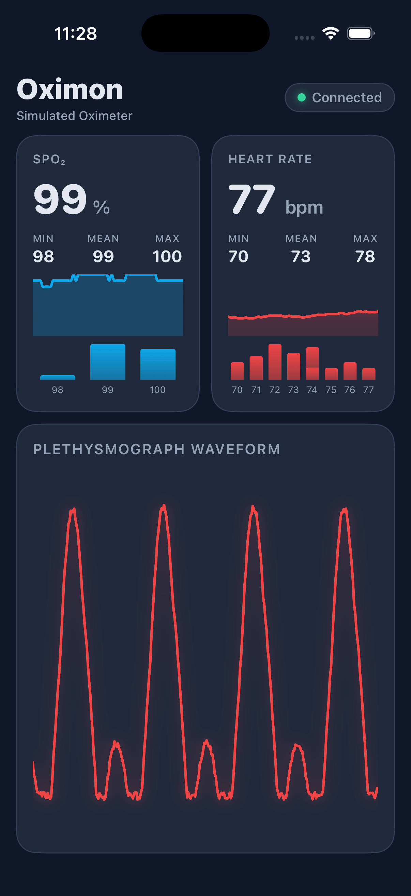

# Oximon iOS

A native SwiftUI iOS app for real-time pulse oximeter telemetry. Connects directly to Innovo/BerryMed Bluetooth pulse oximeters via CoreBluetooth — no server or companion app required.

This is the iOS companion to the [oximon](../) daemon, providing the same dashboard experience on iPhone.



## Features

- **Real-time SpO₂ and heart rate** with animated numeric transitions
- **Trend charts** — rolling 60-sample line charts with area gradients
- **Distribution histograms** — adaptive bin count that scales to the data range
- **Plethysmograph waveform** — 300-sample real-time waveform with glow effect
- **Heartbeat animation** — the heart rate card pulses on each new reading
- **Auto-connect** — scans for known oximeter devices by name and connects automatically
- **Auto-reconnect** — reconnects with 3-second backoff on disconnect
- **Simulator mode** — generates realistic synthetic data for UI testing without hardware

## Requirements

- **Xcode 15+**
- **iOS 17.0+** (deployment target)
- **[XcodeGen](https://github.com/yonaskolb/XcodeGen)** — install with `brew install xcodegen`
- An Innovo iP900BPB Bluetooth pulse oximeter

## Getting Started

### 1. Generate the Xcode project

The `.xcodeproj` is not checked in — it's generated from `project.yml`:

```bash
cd ios/
brew install xcodegen  # if not already installed
xcodegen generate
```

### 2. Open in Xcode

```bash
open Oximon.xcodeproj
```

### 3. Configure signing

1. Select the **Oximon** target in the project navigator
2. Go to **Signing & Capabilities**
3. Set **Team** to your Apple ID (a free account works for personal development)
4. Change the **Bundle Identifier** if `com.robshakir.oximon` conflicts with your account

### 4. Run on the Simulator

Select an iPhone simulator from the scheme destination picker and press **⌘R**.

The app auto-detects the Simulator environment and uses a `SimulatedOximeterManager` that generates realistic synthetic data — including a PPG waveform with systolic peaks and dicrotic notches, and physiologically plausible SpO₂/pulse drift.

### 5. Run on a physical iPhone

1. Connect your iPhone via USB (required once for initial developer pairing)
2. Enable **Developer Mode** on the iPhone: **Settings → Privacy & Security → Developer Mode**
3. Select your iPhone as the run destination in Xcode and press **⌘R**
4. On first launch, trust the developer certificate: **Settings → General → VPN & Device Management → [your Apple ID] → Trust**

After the initial USB pairing, you can enable **Connect via Network** in Xcode's **Devices and Simulators** window (⇧⌘2) for wireless deployment.

## Supported Devices

This app has been tested with the **Innovo iP900BPB** pulse oximeter. The app scans for BLE peripherals matching known name patterns and can be extended to support other devices.

To add support for a new oximeter, add its advertised BLE name (or a substring) to the `knownNamePatterns` array in [`OximeterManager.swift`](Oximon/Models/OximeterManager.swift).

## Architecture

The app uses the same packet parsing logic as the Go daemon:

- **Waveform packets**: 2 bytes — `[0x01, amplitude]` at ~50 Hz
- **Reading packets**: 13 bytes — `[0x3E, spo2, _, pulse, ...]` at ~1 Hz
- **Calibrating**: Reading packet with zero SpO₂/pulse (sensor active, no pulse lock)

The BLE data characteristic is `FFF1`, which on the iP900BPB lives under the Nordic UART service (`6E400001-B5A3-F393-E0A9-E50E24DCCA9E`), not under a `FFF0` service as might be expected.

## Testing

Run the unit tests with **⌘U** in Xcode:

- **PacketParserTests** (12 tests) — port of the Go `ble_test.go` table-driven tests, plus boundary values and real captured device data
- **HistogramBinningTests** (7 tests) — validates adaptive bin count logic for narrow and wide data ranges

## Project Structure

```
ios/
├── project.yml                          # XcodeGen spec
├── Oximon/
│   ├── App/OximonApp.swift              # Entry point (auto-selects real vs simulated BLE)
│   ├── Models/
│   │   ├── PacketParser.swift           # Port of Go ParsePacket()
│   │   ├── OximeterManager.swift        # CoreBluetooth central manager
│   │   ├── OximeterDataSource.swift     # Protocol for real/simulated interchangeability
│   │   └── SimulatedOximeterManager.swift
│   ├── Views/
│   │   ├── DashboardView.swift          # Root layout (generic over data source)
│   │   ├── MetricCardView.swift         # SpO₂/HR card with stats, trend, histogram
│   │   ├── TrendChartView.swift         # Swift Charts trend line
│   │   ├── HistogramView.swift          # Swift Charts adaptive histogram
│   │   ├── WaveformView.swift           # Canvas-based plethysmograph
│   │   └── ConnectionStatusView.swift   # Status pill badge
│   ├── Theme/Theme.swift                # Design tokens (dark slate palette)
│   └── Resources/
│       ├── Info.plist                   # BLE permissions + background mode
│       └── Assets.xcassets/
└── OximonTests/
    ├── PacketParserTests.swift
    └── HistogramBinningTests.swift
```
